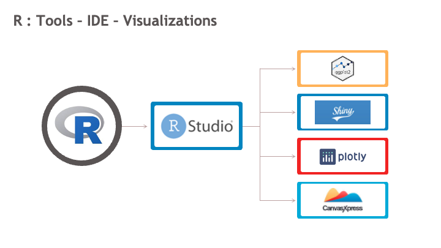
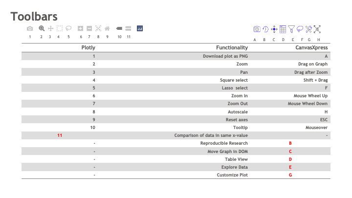
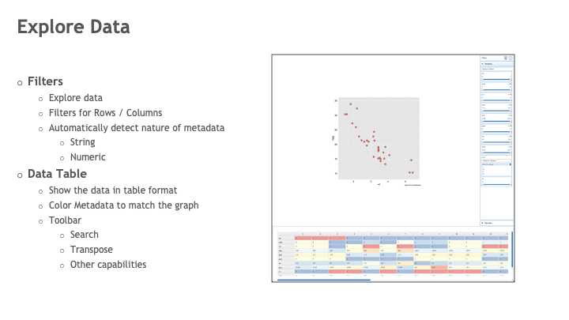
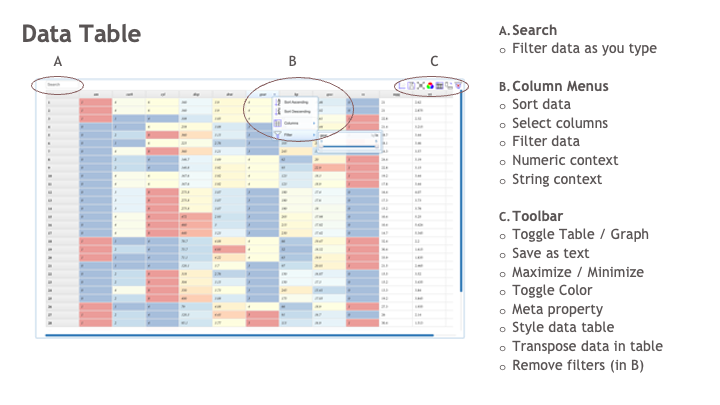
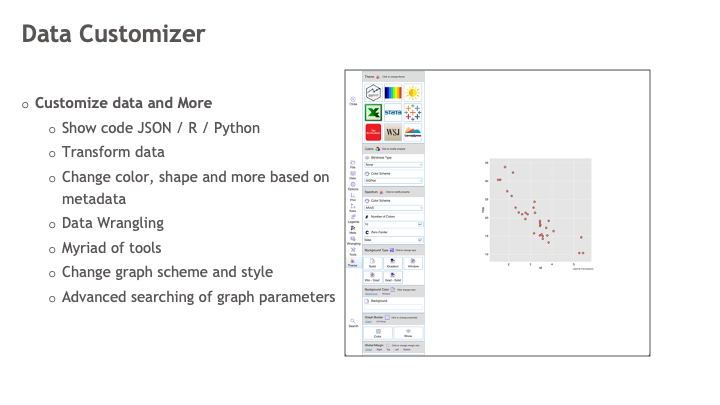
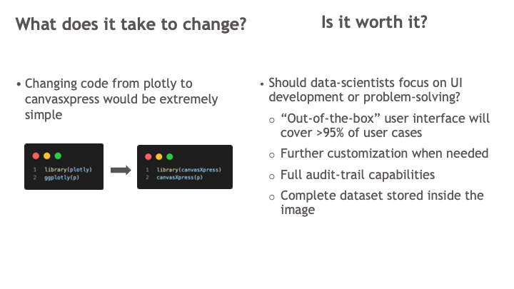

<style>
.main-container { width: 1400px; max-width:1500px;}
</style>

### Some tools used in data science


R, Python, Tableau, Spotfire, Power BI

### This demo covers the R-based tools


R, R-Studio, Plotly  and now CanvasXpress 

### Let's start by including all the libraries for the demo

```{r, warning=FALSE, message=FALSE}
library(ggplot2)
library(plotly)
library(canvasXpress)
```

### Next, let's use the mtcars data set as example a make a simple scatter plot in ggplot.

```{r}
s <- ggplot(mtcars, aes(wt, mpg)) + geom_point()
s
```


Produces a nice and simple visualization. However, a user cannot interact with it.

### Scatter plot with plotly

```{r}
ggplotly(s)
```

Mouse-over to show tooltip and mouse-over on-top of graph to show a toolbar with some functionality. Double-click to reset.

### Scatter plot with canvasXpress

```{r}
canvasXpress(s)
```

Mouse-over to show tooltip, mouse-wheel to zoom in/out, mouse-drag to pan, click to select and mouse-over on-top of graph to show a toolbar with extensive functionality. Press "ESC" to reset.

### Very small differences in the three graphs above


When you compare the three graphs above, you noticed that the main difference is in the toolbars. ggplot doesn't have one but plotly and canvasXpress do.



This is a brief comparison of the toolbars in plotly and canvasxpress. There is some corresponding functionality in the toolbars of the two libraries. Items in red are unique to each library)  

## CanvasXpress has extensive functionality out-of-the-box without the need of extra coding

### Click in the funnel icon to explore the data


### Click in the table icon to see the data in a table


### Click in the tools icon to customize the data


## Value proposition



This demo shows just a very small set of the CanvasXpress functionality. I would be happy to show you a demo!

### Other examples for you to play

Boxplot plot with ggplot

```{r}
b <- ggplot(mpg, aes(class, hwy)) + geom_boxplot(notch = TRUE)
b
```

Boxplot plot with plotly .... 
hmmmm I guess plotly cannot notch the boxplots
```{r}
ggplotly(b)
```

Boxplot plot with canvasXpress

```{r}
canvasXpress(b)
```

Smooth with ggplot

```{r}
sm <- ggplot(mpg, aes(displ, hwy)) + geom_point(aes(color=drv)) + geom_smooth()
sm
```

Smooth with plotly

```{r}
ggplotly(sm)
```

Smooth with canvasXpress

```{r}
canvasXpress(sm)
```


Contour plot with ggplot

```{r}
data(franke, package = "interp")
  origdata <- as.data.frame(interp::franke.data(1, 1, franke))
  grid <- with(origdata, interp::interp(x, y, z))
  griddf <- subset(data.frame(x = rep(grid$x, nrow(grid$z)),
                              y = rep(grid$y, each = ncol(grid$z)),
                              z = as.numeric(grid$z)),
                   !is.na(z))
c <- ggplot(griddf, aes(x, y, z = z)) +
    geom_contour_filled() +
    geom_point(data = origdata)
c
```

Contour plot with plotly ...... hmmmm It doesn't work with plotly :-)

```{r}
ggplotly(c)
```

Contour plot with canvasXpress

```{r}
canvasXpress(c)
```


Add a new chunk by clicking the *Insert Chunk* button on the toolbar or by pressing *Cmd+Option+I*.

When you save the notebook, an HTML file containing the code and output will be saved alongside it (click the *Preview* button or press *Cmd+Shift+K* to preview the HTML file).

The preview shows you a rendered HTML copy of the contents of the editor. Consequently, unlike *Knit*, *Preview* does not run any R code chunks. Instead, the output of the chunk when it was last run in the editor is displayed.
